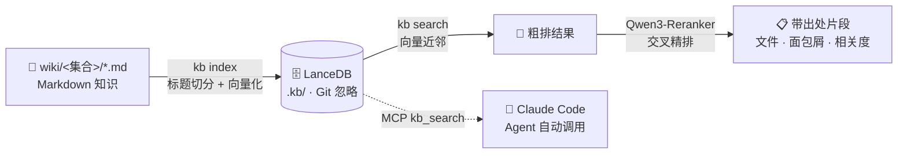

<div align="center">

```text
  ███████╗██╗     ███████╗███████╗██╗   ██╗███████╗
  ██╔════╝██║     ██╔════╝██╔════╝██║   ██║██╔════╝
  █████╗  ██║     █████╗  █████╗  ██║   ██║███████╗
  ██╔══╝  ██║     ██╔══╝  ██╔══╝  ██║   ██║╚════██║
  ███████╗███████╗███████╗██║     ╚██████╔╝███████║
  ╚══════╝╚══════╝╚══════╝╚═╝      ╚═════╝ ╚══════╝
        n a o k e  ·  your offline second brain
```

### 把 Markdown 笔记炼成 **全离线 · 语义检索 · Agent 可调用** 的个人知识库

[](https://www.python.org/)
[](LICENSE)
[](https://docs.astral.sh/uv/)
[](https://lancedb.io/)
[](https://modelcontextprotocol.io/)

**100% 本地运行** · 不上传一个字节 · 断网照常用

</div>

---


## ✨ 为什么是 Eleven-naoke？

| | 特性 | 说明 |
|---|---|---|
| 🔌 | **全离线** | `embeddinggemma-300m` 向量化 + `Qwen3-Reranker-0.6B` 精排，首次自动下载约 1.5GB，此后与云彻底断开 |
| 📝 | **知识即文件** | 纯 Markdown + frontmatter，任何编辑器可写，Git 可版本化，永不锁死在某个 App 里 |
| 🤖 | **双入口** | `kb` 命令行给人用，MCP Server 给 Claude Code 等 Agent 用 |
| ⚡ | **增量索引** | 按文件哈希对比，只重建有改动的文件，改一篇秒级刷新 |
| 🪶 | **轻量模式** | 切换 fastembed 后端（`bge-small-zh`，仅 ~100MB），硬盘紧张也不怕 |
| 🔍 | **带出处检索** | 每条结果都标注 **文件 · 标题面包屑 · 相关度**，答案可溯源 |

## 🏗️ 架构



## 🚀 快速开始

```bash
# 1. 安装（需要 Python 3.11+ 和 uv）
uv sync

# 2. 初始化知识库（在你想放知识库的目录）
uv run kb init

# 3. 放入 Markdown 知识，建立索引
uv run kb index

# 4. 语义检索
uv run kb search "如何设计重试策略"
```

终端里的体验：

```text
$ uv run kb search "如何设计重试策略"

🔍 检索: 如何设计重试策略

1. [0.87] wiki/demo/troubleshoot-重试风暴.md
   └─ demo > 重试风暴 > 指数退避与抖动
2. [0.74] wiki/demo/concept-幂等性.md
   └─ demo > 幂等性 > 重试的前提
3. [0.61] wiki/demo/index.md
   └─ demo > 可靠性设计
```

## 🛠️ 命令一览

| 命令 | 作用 |
|---|---|
| `kb init [-c 集合名]` | 初始化知识库骨架 |
| `kb index` | 增量建立/刷新索引 |
| `kb search "问题" [-k 5] [-c 集合]` | 语义检索，返回带出处的片段 |
| `kb get <路径>` | 查看知识页面全文 |
| `kb status` | 索引状态 + 待提交知识提醒 |
| `kb mcp` | 启动 MCP Server（stdio） |

## 🤖 接入 Claude Code（MCP）

在知识库根目录执行一次：

```bash
claude mcp add kb -- uv run kb mcp
```

之后在 Claude Code 里直接问，Agent 会自动调用 `kb_search` 工具检索你的知识并带引用回答：

> 💬 帮我查一下之前记的重试策略口径

## 📁 知识组织约定

```
wiki/
├── demo/                    # 一个子目录 = 一个知识集合
│   ├── index.md
│   ├── concept-示例知识对象.md
│   └── troubleshoot-示例排查.md
└── notes/                   # 可以有任意多个集合
```

- 文件名建议 `类型-主题.md`（`module-` / `concept-` / `troubleshoot-` / `api-` …），纯约定，索引器不依赖前缀。
- frontmatter 支持 `title`、`tags`、`date`、`source`；`title` 缺省时依次回退一级标题、文件名。
- 一个页面围绕一个**知识对象**：写可复用的结论，不写一次性操作流水。

## 🔬 设计说明

- **切分**：按 Markdown 标题层级切分，每个 chunk 前缀"页面标题 > 章节面包屑"，让短片段也携带完整上下文；超长章节按段落二次切分。
- **检索**：向量近邻检索（L2 距离折算相关度），支持按集合过滤。精确关键词场景直接用编辑器全局搜索即可——知识是纯文本，没必要重复造 BM25。
- **Git 治理**：`kb status` 会提醒 `wiki/` 下未提交的改动；`.kb/`（索引）与 `.venv/` 已被 `.gitignore` 排除，只有知识本身进入版本库。

## ⚙️ 模型配置

默认模型组合（`.kb/config.json`）：

```json
{
  "model": "unsloth/embeddinggemma-300m",
  "backend": "sentence-transformers",
  "rerank": true,
  "reranker_model": "Qwen/Qwen3-Reranker-0.6B"
}
```

<details>
<summary><b>🧩 模型选型细节与深坑记录（点开）</b></summary>

- **embedding**：`google/embeddinggemma-300m` 官方权重在 HuggingFace 是门控模型（需登录并接受许可）；默认配置使用 `unsloth/embeddinggemma-300m` 镜像（同一权重，开箱即用）。如需合规使用官方源，接受许可后 `huggingface-cli login` 再改回 `google/embeddinggemma-300m` 即可。注意 Gemma 许可证条款对使用方式的约束。
- **reranker**：`Qwen/Qwen3-Reranker-0.6B`（Apache-2.0）。checkpoint 本体是 CausalLM，按官方模型卡通过 "yes/no" token 概率对比计算相关度。
- **轻量模式**：`backend` 改为 `fastembed`、`model` 改为 `BAAI/bge-small-zh-v1.5`、`rerank` 改为 `false`，总体积 ~100MB，速度更快，精度略降。
- 查询扩展（用本地 LLM 改写问句）暂未实现，属可选增强。

接入这两个模型时踩过两个深坑（Qwen3-Reranker 分类头缺失、EmbeddingGemma 门控），完整记录见 [docs/model-pitfalls.md](docs/model-pitfalls.md)。

</details>

## 🗺️ Roadmap

- [ ] 关键词 + 向量混合检索（SQLite FTS5）
- [ ] 查询扩展（可选接 Ollama 改写口语化问句）
- [ ] `kb add <file>` 从任意目录吸收知识并自动归类
- [ ] MCP 资源模式：把知识页面暴露为 MCP resources

## 📄 License

[MIT](LICENSE) © Eleven-naoke Contributors

---

<div align="center">

⭐ 觉得有用就点个 Star · 欢迎提 Issue 交流

**知识应该长在你自己的硬盘上。**

</div>
